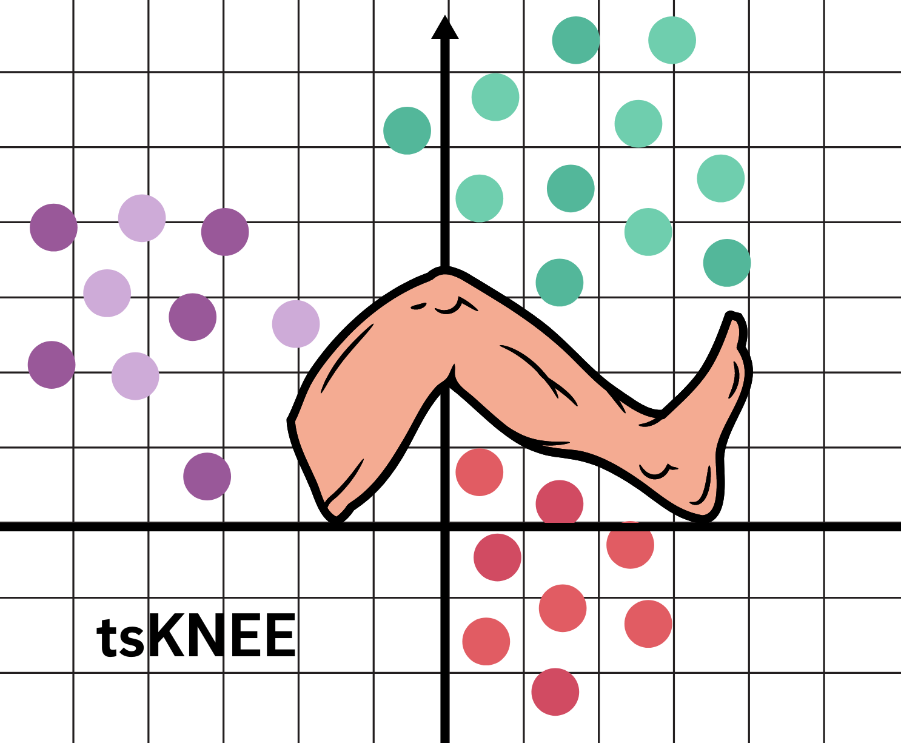

# CSE185_Proj: t-sKNEE

This package implements tsne analysis and plotting. The main tsne calculation function `tsKNEE` takes in an anndata object and outputs a n_obs x 2 array that contains the x and y coordinates for each sample. The tsne plotting function `tsKNEE_plot` takes an anndata obect and generates a tsne plot. 



t-sKNEE implements the functions `scanpy.tl.tsne` and `sc.pl.tsne`. For more information about these functions visit [scanpy](https://scanpy.readthedocs.io/en/stable/api/tools.html) page.

## Installation
First, the user needs to clone the repository using the following command.
```
git clone https://github.com/JL-Young/CSE185_Proj.git
```

Then delete the memusg folder and clone the memusg repository using the following command.
```
cd CSE185_Proj
rmdir memusg
git clone https://github.com/jhclark/memusg.git
```

The user needs to have the following libraries installed: `matplotlib.pyplot`, `numpy`, `scanpy` as well as `leidenalg`. These packages can be found in `requirements.txt`. The following line of code can be run in command line for for installing these packages.

```
pip install -r requirements.txt 
```
Once the required libraries are installed, you can install `t_sKNEE` with the following command.
```
python setup.py install
```

If you do not have admin access, the packages can be installed using the following commands.
```
pip install --user -r requirements.txt
python setup.py install --user
```

## Data preprocessing and Usage

`tsKNEE` is designed to be used in a python notebook or script. The user can create a notebook within the repository and import the package using `import tsKNEE`. Afterwards, the user can import their data of choice and store it as an anndata object. The input anndata object needs to be **leiden clustered** and have **graph neighbors** in prior to utilizing `tsKNEE`. The anndata object needs to have a column named `leiden` in `anndata.obs` dataframe storing the cluster information for the sample. Before using `tsKNEE_plot`, the input anndata object must have `X_tsne` within `anndata.obsm` which is the output of the `tsKNEE` function. The following lines of code below serve as an example of how to set up for `tsKNEE` usage. More examples can be seen in the "tskNEE/test_tsKNEE.ipynb". 

```
adata = sc.read_h5ad("../small_test_data/small_test_data1.h5ad")
sc.pp.neighbors(tsne_adata)
sc.tl.leiden(tsne_adata) 
```

The desired quality control should be done before using t-sKNEE. 

## Components

There are two functions you can run within `tsKNEE`- `tsKNEE` and `tsKNEE_plot`. The only required parameters for both functions is an anndata object. See Data Processing section for more information on the anndata object.

The basic usage of `tsKNEE` is: 
```
tsKNEE(adata, T=1000, perp = 30)
```
- `T=1000`: the number of iterations tsKNEE goes through to plot samples with according to a similarity matrix
- `perp=30`: the perplexity 

The basic usage of `tsKNEE_plot` is: 
```
tsKNEE_plot(adata, perp = 30, xlabel = "tsne1", ylabel = "tsne 2", title = "", save = None)
```
- `xlabel = "tsne1"`: the x-axis label for the graph
- `ylabel = "tsne 2"`: the y-axis label for the graph
- `title = ""`: the graph title
- `save = None`: the name to the png file (string) for saving the plot

## Testing 

To test `tsKNEE` and `tsKNEE_plot` on a small dataset, the `tsKNEE/test_tsKNEE.ipynb` can be run. 

To run benchmarking, use this command to clone the `memusg` folder in the `CSE185_Proj` directory: 

```
git clone https://github.com/jhclark/memusg.git
```

### Origin of Data

Data is taken from CSE185 Lab 6 that was originally taken from the this paper [Functional, metabolic and transcriptional maturation of human pancreatic islets derived from stem cells](https://www.nature.com/articles/s41587-022-01219-z.pdf) and this [GEO website](https://www.ncbi.nlm.nih.gov/geo/query/acc.cgi?acc=GSM5114474). 

### Method
The dataset `GSM5114474_M3_E7` is read in as anndata object. Cells with less than 200 genes expressed and less than 1000 total reads are filtered out. Genes detected in less than 5 cells and genes that have total count of less than 15 is filtered out. 

A random list is generated for the obs and vars. The whole dataset is subsetted by the value of the random number to aroudn 50 obs x 1000 vars. However everytime, the script is ran, the dataset will differ. The anndata is then saved to `h5ad` file format (currently commented out). 

test_data1 has 69 obs x 942 vars.

### Contributors

This repository was generated by Jane Li, Jeyasri Venkatasurbamani, and James Young with inspiration from the [Medium](https://towardsdatascience.com/understanding-t-sne-by-implementing-2baf3a987ab3).
